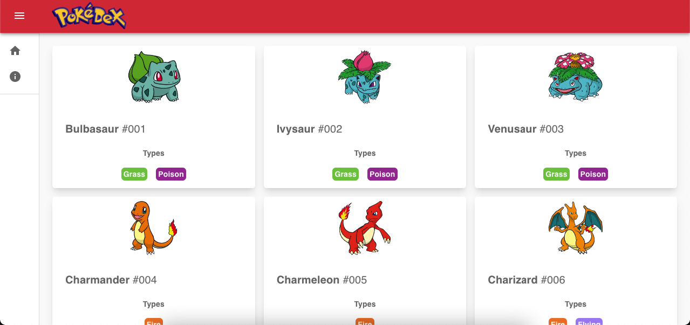

<p align="left">
   
</p>

# Pokedex

> A simple pokedex made with ReactJS and https://pokeapi.co for learning and entertainment purposes.

[](https://github.com/harbsprog)
[](#)
[](https://github.com/Harbsprog/pokedex/stargazers)
[](https://github.com/Harbsprog/pokedex/network/members)
[](https://github.com/Harbsprog/pokedex/graphs/contributors)

<p align="center">
   
</p>

# :pushpin: Table of Contents

- [Features](#rocket-features)
- [Goals](#dart-goals)
- [Installation](#construction_worker-installation)
- [Getting Started](#runner-getting-started)
- [FAQ](#postbox-faq)
- [Found a bug? Missing a specific feature?](#bug-issues)
- [Contributing](#tada-contributing)
- [License](#closed_book-license)

# :rocket: Features

- [ ] Explore pokemons
- [ ] Search pokemons by name
- [ ] See the abilities and damage level of pokemons in the details page

# :dart: Next Improvements

These are the next improvements a are implemented:

- [ ] Search pokemons.
- [ ] Pokemons details page.
- [ ] Use Recoil.JS.
- [ ] Use Vercel SWR.

# :construction_worker: Installation

**You need to install [Node.js](https://pt-br.reactjs.org/) and [Yarn](https://yarnpkg.com/) first, then in order to clone the project via HTTPS, run this command:**

```
  git clone https://github.com/harbsprog/pokedex.git
```

SSH URLs provide access to a Git repository via SSH, a secure protocol. If you have a SSH key registered in your Github account, clone the project using this command:

```
  git clone git@github.com:harbsprog/pokedex.git
```

**Install dependencies**

```
  yarn install
```

# :runner: Getting Started

Run the following command in order to start the application.

```
  yarn start
```

# :postbox: F.A.Q

**Question:** What are the tecnologies used in this project?

**Answer:** The tecnologies used in this project are [Material-UI](https://material-ui.com/components/drawers/) + [ReactJS](https://reactjs.org/) and another amazing libs.

# :bug: Issues

Feel free to file a new issue with a respective title and description on the Pokedex repository. If you already found a solution to your problem, I would love to review your pull request!

# :tada: Contributing

Check out the [contributing](https://github.com/harbsprog/pokedex/blob/master/CONTRIBUTING.md) page to see the best places to file issues, start discussions and begin contributing.

# :white_flag: Open API


Pokedex using the [PokeAPI](https://pokeapi.co/) for constructing RESTful API.<br>
PokeAPI provides a RESTful API interface to highly detailed objects built from thousands of lines of data related to Pokémon.

# :closed_book: License

Released in 2020.
This project is licensed under the [MIT license](https://github.com/harbsprog/pokedex/master/LICENSE).

Made with love in Brazil by [Harbsprog](https://github.com/harbsprog) 🚀
